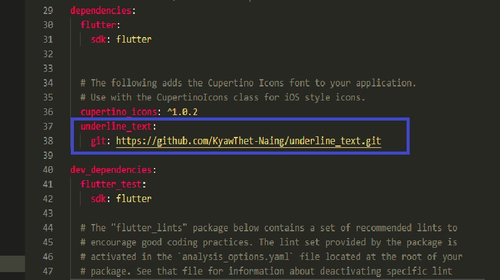
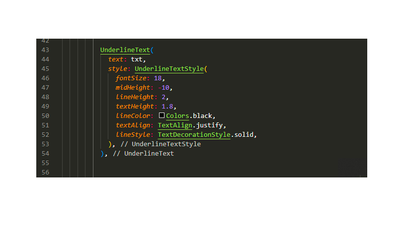
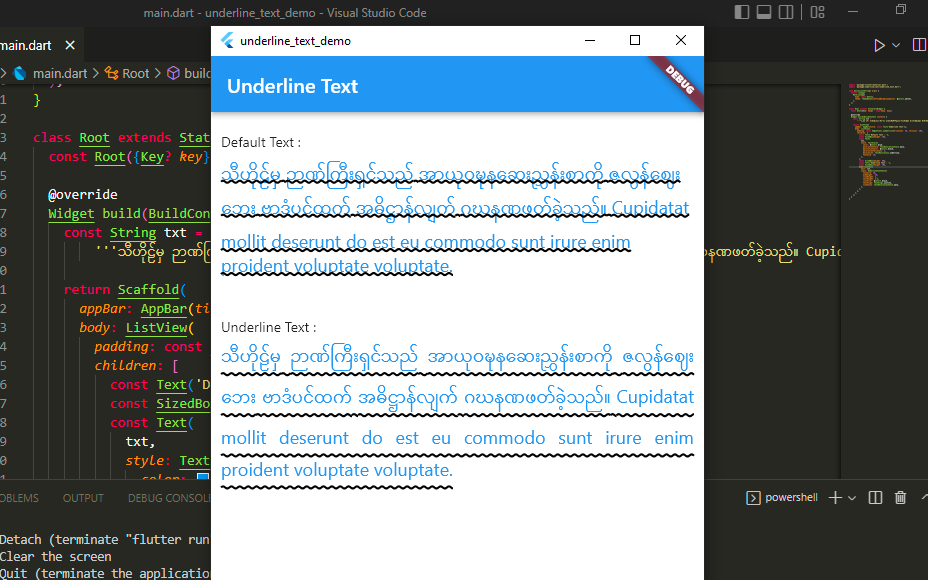
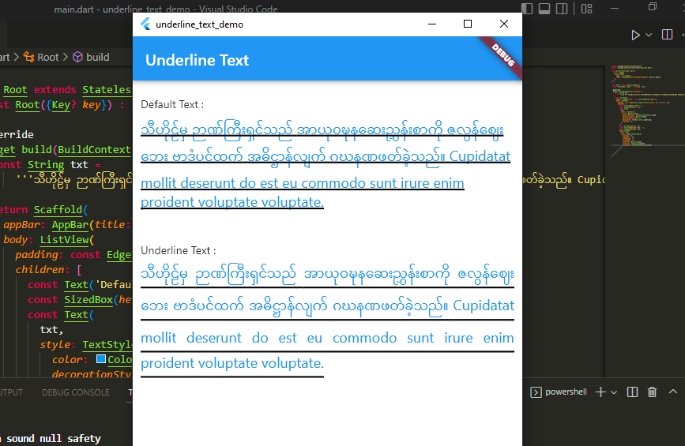

# underline_text_demo

Install package

```bash
 underline_text:
   git: https://github.com/KyawThet-Naing/underline_text.git
```



```bash
  flutter pub get
```

Import package

```bash
import 'package:underline_text/underline_text.dart';
```

Uses

```bash
    UnderlineText(
      text: txt,
      style: UnderlineTextStyle(
         fontSize: 18,
         midHeight: -10,
         lineHeight: 2,
         textHeight: 1.8,
         lineColor: Colors.black,
         textAlign: TextAlign.justify,
         lineStyle: TextDecorationStyle.solid,
             ),
        ),
```




# Demo Preview 1


# Demo Preview 2

